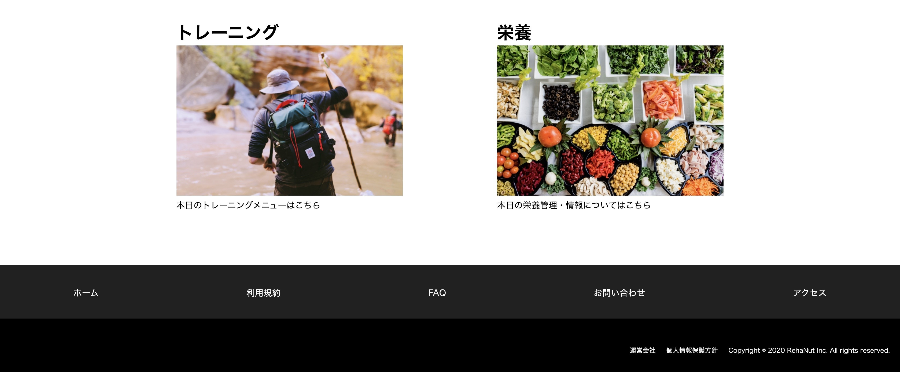

# README

# 概要

## アプリ名: RehaNut(リハニュート）  
いつでもどこでも誰でも何度でもリハビリテーションを提供。  
高齢者向け、在宅で行えるリハビリテーションアプリケーション。  
一人一人にあった栄養に関する情報提供、栄養摂取方法を提案。  

  

## 誰のどんな問題を解決するのか（制作した経緯）
### 誰の
・日常生活が自立している高齢者（介護保険サービスが利用できない高齢者）  
・リハビリテーションを受けたくても受けられない高齢者  
・コロナ渦において自宅でリハビリテーション、トレーニングを行いたいと思っている高齢者

### どんな問題を解決するのか
在宅で行うリハビリテーション、トレーニングの方法がわからないこと。  

### 制作した経緯
私自身、理学療法士をしています。  
退院される患者様から「自宅でもリハビリや運動を続けたいけどどうしたら良いかわからない」という声を多くいただきます。  
退院前には紙資料を用いて自宅で行える自主トレーニングの指導を行っています。  
しかし、実際に自宅でトレーニングを継続できている方は非常に少ないです。  
また、紙資料では一人一人にパーソナライズされたプログラムが提供できないことも問題点の一つです。

そこで、自宅でもリハビリテーション・トレーニングを継続したいという高齢者向けのサービスがあれば良いと思い制作に至りました。

# 開発状況
開 発 環 境：Ruby/Ruby on Rails/MySQL/Github/heroku/Visual Studio Code/haml&Scss  
開 発 期 間：約3週間  
平均作業時間：約2時間

# 開発した機能
## ユーザーログイン機能
deviseを用いたログイン機能

## コメント機能
非同期通信によるコメント送信機能

# 本番環境
URL: https://rehanut.herokuapp.com/

# 動作確認方法
Chromeの最新版を利用してアクセスしてください。ただしデプロイ等で接続できないタイミングもございます。  
その際は少し時間をおいてから接続ください。

# DEMO

# 課題や今後実装したい機能
## 課題
ユーザー完結型ではないため、コンテンツを用意しなければいけません。
現段階ではコンテンツまで用意することは難しいと感じています。
そのため、リハビリテーションプログラムはテキストと画像、動画での配信を考えているものの、現段階ではコンテンツを用意できていません。
また、栄養に関する情報提供、栄養摂取方法の提案に対しても同様にコンテンツを用意することができていません。
そして、高齢者向けのサービスであるため、高齢者でも使いやすい・わかりやすいようなアプリケーションにしなければいけないと感じました。  

## 今後実装したい機能
現在は一つずつ機能を追加している状態です。
まだまだ完成には程遠いためユーザー目線に立ち、良いサービスが提供できるようにしていきたいと思います。
・ 一人一人にパーソナライズされたリハビリテーションプログラムの提供、栄養に関する情報・摂取方法の提案
・ レスポンシブデザイン（高齢者に見やすい、わかりやすいデザイン) 

# rehanut DB設計

##  contentsテーブル（コンテンツ機能）
|Column|Type|Options|
|------|----|-------|
|text|text|null: false|
|image|string||
|video|string||
### contents-Association
- belongs_to :users
- has_many :comments

## usersテーブル（ユーザー管理機能）
|Column|Type|Options|
|------|----|-------|
|name|string|null: false, add_index: true|
|email|string||
|password|string|null: false|
### users-Association
- has_many :contents
- has_many :comments

## commentsテーブル（コメント機能）
|Column|Type|Options|
|------|----|-------|
|comment|string|
|image|string|
|user_id|integer|null :false, foreign_key: true|
### comments-Association
- belongs_to :user
- belongs_to :content

## contents_usersテーブル
|Column|Type|Options|
|------|----|-------|
|user_id|integer|null: false, foreign_key: true|
|content_id|integer|null: false, foreign_key: true|
### contents_users-Association
- belongs_to: user
- belongs_to: content
